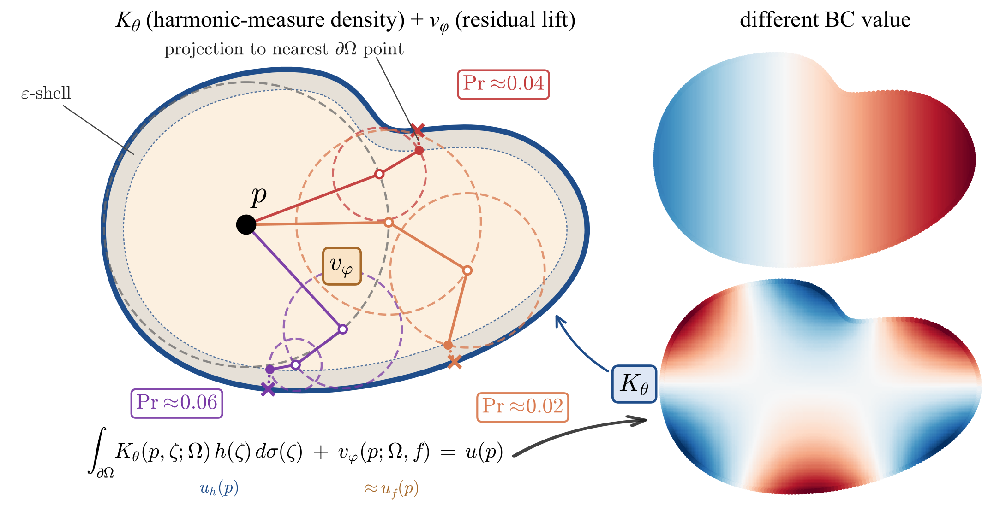

<div align="center">
<h2>Neural Harmonic Measure Operator</h2>

[**Jinjin He**](https://jinjinhe2001.github.io/) · [**Sinan Wang**](https://sinanw.com/) · [**Yuchen Sun**](https://yuchen-sun-cg.github.io/) · [**Bo Zhu**](https://faculty.cc.gatech.edu/~bozhu/)

Georgia Institute of Technology

<span style="font-size: 1.5em;"><b>NeurIPS 2026</b></span>

<a href="https://arxiv.org/abs/2609.35752"></a>
<a href="https://openreview.net/forum?id=csUQ0IwX0R"></a>
<a href="https://jinjinhe2001.github.io/nhmo/"></a>
<a href="https://huggingface.co/jinjinhe2001/NHMO"></a>



## TL;DR
NHMO learns the density of a domain's harmonic measure as a geometry-only boundary kernel, trained from Walk-on-Spheres exits, and adds a learned lift for sources. One kernel per shape then solves any new boundary data and source on that shape without retraining.
</div>

# Setup
The code was tested with Python 3.12, PyTorch 2.11 and CUDA 13.0 on NVIDIA A100 GPUs. Training and the Walk-on-Spheres samplers need a CUDA GPU (NVIDIA Warp).
```bash
git clone https://github.com/jinjinhe2001/NHMO-Neural-Harmonic-Measure-Operator.git nhmo && cd nhmo
python -m venv .venv && source .venv/bin/activate
pip install -r requirements.txt
```
Install the PyTorch wheel that matches your CUDA driver first if the default one does not. `lapy` is only needed to generate new 3D OOD problems.

All scripts read their paths from `scripts/env.sh` (`MCB_ROOT`, `MNIST_ROOT`, `NHMO_DATA_2D`, `NHMO_CKPT_DIR`, `RESULTS_DIR`); edit it and run `source scripts/env.sh`.

# Checkpoints and data
Checkpoints and data are hosted on the [Hugging Face Hub](https://huggingface.co/jinjinhe2001/NHMO).
```bash
hf download jinjinhe2001/NHMO --exclude "data/*" --local-dir checkpoints   # 16 checkpoints, 238 MB
hf download jinjinhe2001/NHMO --include "data/*" --local-dir .             # 2D benchmark and 3D OOD sets, 5.5 GB
cd data
cat mnist_pde_2d_paramBC_lf_train.tar.gz.part-* | tar xzf -
for f in mnist_pde_2d_paramBC_lf_test mnist_kernel_targets_mask mcb_ood3d_problems nhmo_reference_results; do tar xzf $f.tar.gz; done
cd ..
```
`checkpoints/3d/` holds one kernel and one lift per MCB-B category; `checkpoints/2d/` holds the 2D kernel, the 2D lift, and the source lift and residual head of the three-term variant. `MANIFEST.md` on the Hub describes each file.

The `data/` folder contains the 2D training data (the train split of the 2D benchmark and the Walk-on-Spheres targets of the 2D kernel), the 2D test splits, and the 3D coefficient-OOD problem sets.

**MCB-B (3D).** The 3D training and test data are MCB-B, a subset of the [Mechanical Components Benchmark (MCB)](https://github.com/stnoah1/mcb), with the tetrahedral meshes, boundary data, sources and FEM solutions released by [NGF](https://github.com/KAIST-Visual-AI-Group/NGF) as the Hugging Face dataset [DveloperY0115/ngf-mcb](https://huggingface.co/datasets/DveloperY0115/ngf-mcb). The kernels are trained on the training meshes with Walk-on-Spheres exits sampled online, and the lifts on the FEM solutions of the training shapes. Download the solutions and copy NGF's split files `data_list_paths/mcb_b/<category>/*.txt` to `$MCB_ROOT/splits/<category>/`.
```bash
hf download DveloperY0115/ngf-mcb --repo-type dataset --include "*sol.npz" \
    --revision 50bca56847ba02be7122b3a8c2ca89d0db290a7f --local-dir $MCB_ROOT/ngf_solutions
```

**2D MNIST benchmark.** The released archive contains all three splits. To regenerate it, download MNIST and run the generator:
```bash
python -c "import torchvision; torchvision.datasets.MNIST('data', download=True)"
python tools/gen_mnist_pde_data_param_bc.py --mnist-dir data/MNIST/raw --out data/mnist_pde_2d_paramBC --seed 0
python tools/filter_param_bc.py data/mnist_pde_2d_paramBC data/mnist_pde_2d_paramBC_lf
```

# Evaluation
Each script writes per-pair JSONs to `$RESULTS_DIR`.
```bash
bash scripts/reproduce_table1.sh      # 2D MNIST benchmark; VARIANT=1 adds the residual-head row
bash scripts/reproduce_table2.sh      # MCB-B Poisson (Tables 2 and 3)
bash scripts/reproduce_table4.sh      # synthetic Laplace probe
bash scripts/ood_3d.sh                # 3D coefficient OOD
bash scripts/bench_3d.sh              # 3D runtime
```

To solve new problems on an MCB-B shape, build the per-shape cache once and reuse it for every boundary condition and source:
```python
from nhmo.eval.mcb_lift import load_models
from nhmo.core.fast_inference import precompute_shape, solve_cached
from nhmo.data.mcb_loader import load_mcb_eval_fields

kernel, lift, _, _ = load_models("checkpoints/3d/kernel_nut.pt", "checkpoints/3d/lift_nut.pt", "cuda")
sol = "data/MCB_benchmark/ngf_solutions/nut/00041792/poisson-1.25_B-1.5_C-1.5_D-1.5_BD-0/sol.npz"
cache = precompute_shape(kernel, sol, device="cuda")      # once per shape
f = load_mcb_eval_fields(sol)                             # any (h, f) on the same mesh
u_h, v = solve_cached(lift, cache, f.bd_v_inds, f.bd_v_vals, f.source_term)
u = (u_h + v).cpu().numpy()
```

# Training
**3D (MCB-B).** The kernel of each category is trained from Walk-on-Spheres exits; the lift is then trained on the FEM solutions with the kernel frozen. The released kernels start from `checkpoints/3d/init/kernel3d_init_warmup.pt` (sphere pretraining and a short MCB warm-up, see `configs/pretrain_sphere.yaml` and `configs/mcb_warmup.yaml`).
```bash
python -m nhmo.train.mcb_main --config configs/mcb/nut.yaml \
    --warm-start checkpoints/3d/init/kernel3d_init_warmup.pt
python -m nhmo.train.poisson_lift_train --kernel-ckpt checkpoints/3d/kernel_nut.pt --category nut \
    --n-source-slices 256 --n-cross-layers 3 --total-steps 20000 --checkpoint-every 2000 --out runs/lift_nut
```
The other categories use their own config. The fitting kernel starts from `checkpoints/3d/init/kernel3d_init_fitting_pre44k.pt`, and its lift uses `--n-source-slices 384`. The released lifts were trained further in warm-start rounds (`--warm-start <previous lift>`).

**2D (MNIST).**
```bash
python -m nhmo.train.mnist_kde_main --config configs/mnist_kernel.yaml \
    --omega-gt-train data/mnist_kernel_targets_mask/omega_mask_5k.pt --total-steps 60000 --seed 0 --out runs/kernel_2d
K=runs/kernel_2d/checkpoint_step_60000.pt
python tools/uh_cache_2d.py --kernel-ckpt $K --out data/uh_cache_train128
C="--uh-cache-dir data/uh_cache_train128 --seed 0"
# kernel + lift
python -m nhmo.train.poisson_lift_field_train_2d --kernel-ckpt $K --lift-inputs mhfu $C \
    --base-channels 48 --depth 4 --total-steps 10000 --use-y-norm --out runs/lift_2d
# three-term variant: source-only lift, then residual head
python -m nhmo.train.poisson_lift_field_train_2d --kernel-ckpt $K --lift-inputs msf --include-laplace $C \
    --base-channels 64 --depth 4 --total-steps 30000 --use-y-norm --out runs/lift_2d_msf
python -m nhmo.train.residual_head_train_2d --kernel-ckpt $K $C \
    --frozen-lift-ckpt runs/lift_2d_msf/checkpoint_step_30000.pt --out runs/rhead_2d
```
The kernel targets can be regenerated with `tools/gen_mask_corpus.py`.

# Citation
If you find our work useful, please consider citing:
```bibtex
@inproceedings{he2026nhmo,
  title     = {Neural Harmonic Measure Operator},
  author    = {He, Jinjin and Wang, Sinan and Sun, Yuchen and Zhu, Bo},
  booktitle = {NeurIPS},
  year      = {2026},
}
```
The code is released under the MIT License. MCB-B is the NGF release of the MCB dataset; please also cite [NGF](https://github.com/KAIST-Visual-AI-Group/NGF) and [MCB](https://github.com/stnoah1/mcb) when you use it.
